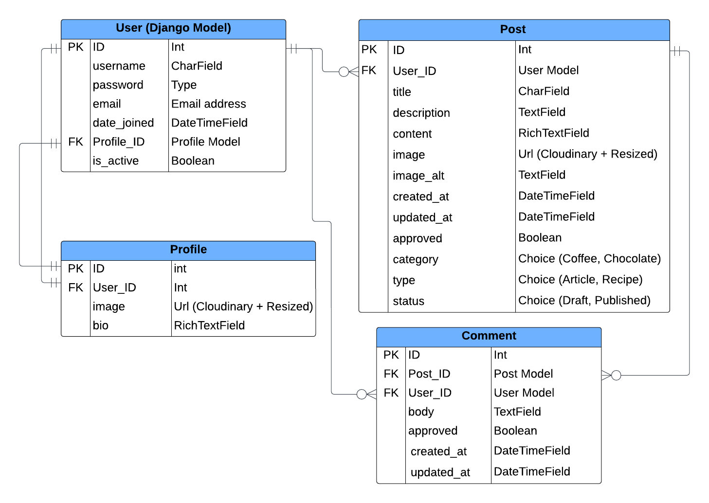

# Coffee & Chocolate Blog [(*Live site*)](https://coffee-choco-blog-7ff7b0b383df.herokuapp.com/)

## Introduction 

Coffee & Chocolate blog is a blog style website for those who love coffee and chocolate. Here users can find articles and recipes as well as post their own. A comments section facilitates communication between users. Only registered users can create new posts, comment and give likes, save favourite recipes or articles to read later. 

## Table of contents

- [Live site](#coffee--chocolate-blog-live-site)
  - [Introduction](#introduction)
  - [Table of contents](#table-of-contents)
  - [UX](#ux)
    - [Target Audience](#target-audience)
    - [User Goals](#user-goals)
    - [Agile Development Tool](#agile-development-tool)
    - [User Stories](#user-stories)
  - [UX design](#ux-design)
    - [Wireframe](#wireframe)
    - [Structure \& Logical Flow](#structure--logical-flow)
    - [Colour Scheme](#colour-scheme)
    - [Fonts](#fonts)
  - [Features](#features)
    - [Existing Features](#existing-features)
    - [Future Features](#future-features)
  - [Technologies Used](#technologies-used)
    - [Coding languages used](#coding-languages-used)
    - [Frameworks and Libraries used](#frameworks-and-libraries-used)
  - [Testing](#testing)
  - [Deployment](#deployment)
    - [To deploy the project to Heroku](#to-deploy-the-project-to-heroku)
    - [To fork the project](#to-fork-the-project)
    - [To clone the project](#to-clone-the-project)
  - [Credits](#credits)
    - [Colour Theme](#colour-theme)
    - [Project](#project)
    - [Articles and Recipes](#articles--recipes)
    - [Media](#media)
    - [Tools](#tools)
  - [Acknowledgements](#acknowledgements)

## UX

### Target Audience

* People interested in reading about coffee and chocolate
* People interested in posting recipes or articles about coffee and chocolate
* People interested in finding a community to chat about a given topic (comments section)

### User Goals

**First Time User would like to**

* Find out the purpose of the site and how to use it
* Be able to easily navigate throughout the site
* See a list of posts to see if the site is something they would be interested in
* See the latest posts
* Be able to register for a user account

**Registered User would like to**

* Sign into their user account
* View posts and leave comments
* Create their own post
* Edit and delete their own posts only
* Logout of their account to keep their account secure

**Site Owner would like to**

* Restrict access to non-registered users
* Control users posts and comments for inappropriate use of the site. All posts and comments must be approved by Admin before they are live on the site

### Agile Development Tool

### User Stories

## UX design

### Wireframe

The original layouts look different from the finished blog as some changes were made during the development process.

Home

Blog

Post view

Recipes

Recipe view

Sign Up

Login

Profile

Logout

### Structure & Logical Flow

The database model diagram was designed using Lucidchart

### Colour Scheme

The colours were mostly taken from bootstrap colour palette. They are:
- `#212529` - text colour for post, comment, buttons; outline and hover effects on buttons
- `#FFFFFF` - background colour for post, modal; text colour for buttons when hovered over
- `#212529BF` - text colour for secondary text in post, comment
- `#21252908` - background colour for secondary text on the post card
- `#e9ecef` - background colour for comment that is waiting for approval
- `#dc3545` - text colour for X icon used for deleting the comment; text colour and border colour for confirm button when deleting post or comment; background colour for confirm button when hovered over
- `#f6f6f6` - background colour for header, footer
- `#86b7fe` - border colour and shadow for input when focused on it
- `#f8f9fa` - background colour for text messages ("No posts yet", "No comments yet"), buttons; text colour for welcome text on the home page
- `#000000` - text colour for active navigation menu item
- `#d1e7dd` - background colour for message
- `#0a3622` - text colour for message 
- `#a3cfbb` - border colour for message
- `#00000040` - background colour for login, signup forms
- `#00000080` - background colour for welcome text on the home page

Custom colours:
- `#e99767` - border accent colour for post title; circle colour for unordered list item's marker
- `#592c12` - text colour for navigation menu items
- `#f2d9cb` - background colour for main content
- `#5f4e2a` - border colour for active navigation menu item

### Fonts

- 'Playfair Display' (backup 'serif') was used as a main title font. It looks nice for titles and subtitles for posts.
- 'Halant' (backup 'serif') was used as a sub-title font. It was rarely used but it also looks nice with the other two fonts.
- 'Roboto' (backup 'serif') was used as a main text font. It is easy to read even if the text is small.

## Features

### Existing Features

### Future Features

## Technologies Used

### Coding languages used

* HTML
* CSS
* Python
* JavaScript

### Frameworks and Libraries used

**Django**
* Framework used to build this project. Provides a built in admin panel and includes many helper template tags that make writing code quick and efficient.

**Django-Allauth**
* Used for User authenticaion (register, login and logout).

**Django Crispy Forms**
* Used to control rendering of Django forms.

**PostgreSQL**
* The database used by the deployed project on Heroku.
  
**psycopg2**
* PostgreSQL database adapter for the Python programming language.

**Gunicorn**
* Python HTTP server for WSGI applications.

**Django RichTextField**
* A Django model field and widget that renders a customizable rich text/WYSIWYG widget.

**Django Resized**
* Resizes image origin to specified size.

**Cloudinary**
* The cloud platform used to store static media files.

**Balsamic**
* Used for the wireframes

**Git**
* Used for version control.

**GitHub**
* Used to store the project's code after being pushed from Git.

**GitPod**
* Used as a platform to develop code in a ready-to-code developer environment.

**Heroku**
* The cloud platform used to deploy the project in the live environment.

**Bootstrap**
* The front end development framework used for styling along with custom CSS.
  
**Lucidchart**
* Used for the entity relationship diagram

## Testing

Detailed testing of the site can be found at [TESTING.md](TESTING.md)

Testing includes the following:

* Validator testing
* Responsivness & Browser Compability Testing
* Manual testing
* Browser testing
* Device testing
* Bugs

## Deployment

### To deploy the project to Heroku

Follow these steps to deploy your Django project to Heroku from VS Code:
| ||
| --- | --- |
| **Step 1** Create a New Heroku App |
| - Access the Heroku Dashboard: Log in to your Heroku account and access the dashboard. |
| - Create a New App: Click on the New button in the top-right corner of the dashboard and select Create new app from the dropdown menu. |
| - App Name and Region: Enter a unique name for your app and choose a region closest to you (EU or USA). Click Create App to create the app. |
| **Step 2** Configure Environment Variables |
| - Reveal Config Vars: From the new app Settings, click Reveal Config Vars. |
| - Set Environment Variables: Set your environment variables as follows: |
|   - `CLOUDINARY_URL`: Insert your own Cloudinary API key here. |
|   - `DATABASE_URL`: Insert your own ElephantSQL database URL here. |
|   - `DISABLE_COLLECTSTATIC`: Set to 1 for temporary purposes, and remove it for the final deployment. |
|   - `SECRET_KEY`: This can be any random secret key. |
| **Step 3** Prepare the Project for Deployment |
| - Create a `requirements.txt` File: This file lists all the dependencies required by your project. You can install the project's requirements using `pip3 install -r requirements.txt`. If you have your own packages installed, update the `requirements.txt` file using `pip3 freeze --local > requirements.txt`. |
| - Create a `Procfile`: This file specifies the commands Heroku should run to start your app. Create the Procfile using `echo web: gunicorn app_name.wsgi > Procfile`. Replace `app_name` with the name of your primary Django app, which is the folder where `settings.py` is located. |
| **Step 4** Connect Your GitHub Repository to Heroku |
| - Automatic Deployment: Select Automatic Deployment from the Heroku app settings to automatically deploy your app whenever you push changes to your GitHub repository. |
| - Manual Deployment: Alternatively, you can connect your GitHub repository to Heroku manually using the Terminal/CLI: |
|   - Login to Heroku: Run `heroku login -i` to log in to your Heroku account. |
|   - Set the Remote for Heroku: Run `heroku git:remote -a app_name` to set the remote for Heroku. Replace `app_name` with your app name. |
|   - Push to Heroku: After performing the standard Git add, commit, and push to GitHub, you can now type `git push heroku main` to deploy your app. |
| **Step 5**  Verify Your Deployment |
| - Open App: Once your app is deployed, you can open it by clicking on the Open App button in the Heroku dashboard. This will open your app in a web browser. |
| - Verify App: Verify that your app is running correctly by checking for any errors or issues. |

### To fork the project

Forking the **GitHub** repository allows you to create a duplicate of a local repository. This is done so that modifications to the copy can be performed without compromising the original repository.

- Log in to **GitHub**.
- Locate the repository.
- Click to open it.
- The fork button is located on the right side of the repository menu.
- To copy the repository to your **GitHub** account, click the button.

### To clone the project

- Log in to **GitHub**.
- Navigate to the main page of the repository and click **Code**.
- Copy the **URL** for the repository.
- Open your local **IDE**.
- Change the current working directory to the location where you want the cloned directory.
- Type git clone, and then paste the **URL** you copied earlier.
- Press **Enter** to create your local clone.

## Credits

### Colour Theme

- [Brown coffee chocolate beige theme by Elisa Cazzulo](https://color.adobe.com/de09e28a57de007f885d0c16d3e3-color-theme-12966174/)

### Project

- [Blossom-Therapy-Insights blog](https://github.com/Indre-V/blossom-therapy)

### Articles & Recipes

- [Chocolate Orange and Lemon Mousse Dessert Cups](https://lilyobriens.ie/blog/post/chocolate-orange-and-lemon-mousse-dessert-cups)
- [Frozen Hot Chocolate](https://www.tasteofhome.com/recipes/frozen-hot-chocolate/)
- [Salted Caramel and Chocolate Chunk Cookies](https://lilyobriens.ie/blog/post/salted-caramel-and-chocolate-chunk-cookies)
- [Creamy Caramel Chocolate Mini Cakes](https://lilyobriens.ie/blog/post/creamy-caramel-chocolate-mini-cakes)
- [Belgian Chocolate Lava Puddings](https://lilyobriens.ie/blog/post/belgian-chocolate-lava-puddings)
- [Chocolate Valentine’s Truffles](https://lilyobriens.ie/blog/post/chocolate-valentine%E2%80%99s-truffles-2023)
- [Your Ultimate Guide to Different Types of Coffee](https://www.tasteofhome.com/article/types-of-coffee/)

### Media

- [Coffee and Chocolate photo](https://www.pexels.com/photo/white-printer-paper-on-brown-textile-10254303/)
- [Blog Letters on Brown Wood](https://www.pexels.com/photo/blog-letters-on-brown-wood-262508/)
- [error 404](https://www.pexels.com/photo/error-404-27968632/)

### Tools

- [Abobe Colour](https://color.adobe.com/create/color-wheel)
- [FontJoy](https://fontjoy.com/)

## Acknowledgements

  - [Cohort Facilitator - Marko Tot](https://github.com/tmarkec) for support in the classroom and guidance through the course.
  - [Mentor - Dick Vlaanderen](https://github.com/dickvla) for support throughout the project, ideas and advice.