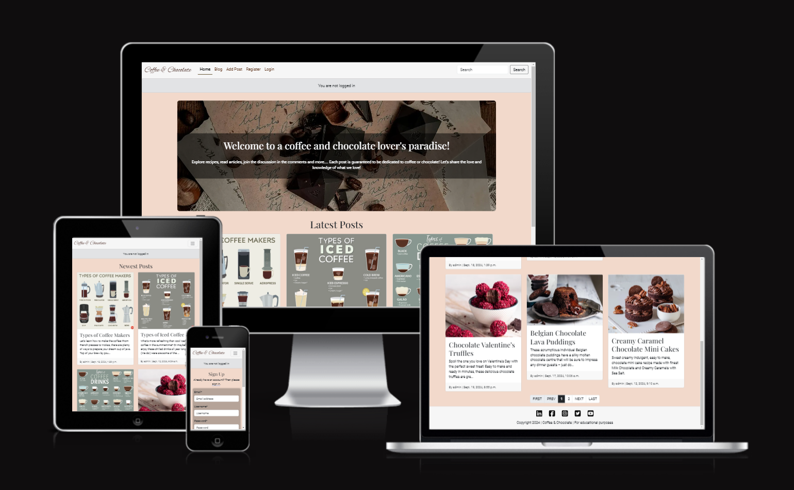
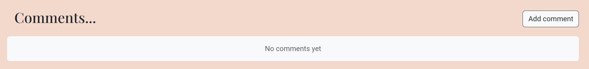
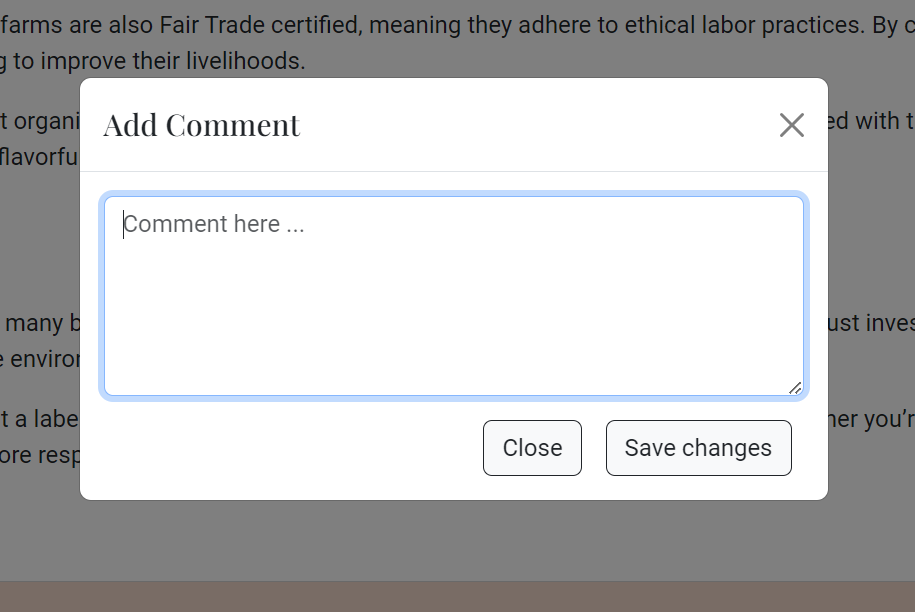

# Coffee & Chocolate Blog [(*Live site*)](https://coffee-choco-blog-7ff7b0b383df.herokuapp.com/)

## Introduction 

Coffee & Chocolate blog is a blog style website for those who love coffee and chocolate. Here users can find articles and recipes as well as post their own. A comments section facilitates communication between users. Only registered users can create new posts, comment and give likes, save favourite recipes or articles to read later. 

## Table of contents

- [Live site](#coffee--chocolate-blog-live-site)
  - [Introduction](#introduction)
  - [Table of contents](#table-of-contents)
  - [UX](#ux)
    - [Target Audience](#target-audience)
    - [User Goals](#user-goals)
    - [Agile Development Tool](#agile-development-tool)
    - [User Stories](#user-stories)
  - [UX design](#ux-design)
    - [Wireframe](#wireframe)
    - [Structure \& Logical Flow](#structure--logical-flow)
    - [Colour Scheme](#colour-scheme)
    - [Fonts](#fonts)
    - [Responsiveness (media queries)](#responsiveness)
  - [Security Measures and Protective Design](#security-measures-and-protective-design)
    - [User Authentication](#user-authentication)
    - [Password Management](#password-management)
    - [Form Validation](#form-validation)
    - [Database Security](#database-security)
  - [Features](#features)
    - [Header](#header)
    - [Footer](#footer)
    - [Blog page](#blog-page)
    - [Search results page](#search-results-page)
    - [Single Post page](#single-post-page)
    - [Add Post Form](#add-post-form)
    - [Edit Post Form](#edit-post-form)
    - [Delete Post page](#delete-post-page)
    - [Comments section](#comments-section)
    - [Add Comment Form Modal](#add-comment-form-modal)
    - [Delete Comment page](#delete-comment-page)
    - [User Account pages](#user-account-pages)
    - [Profile page](#profile-page)
    - [Edit Profile Form](#edit-profile-form)
    - [Messages](#messages)
    - [Custom error pages](#custom-error-pages)
    - [Future Features](#future-features)
  - [Technologies Used](#technologies-used)
    - [Coding languages used](#coding-languages-used)
    - [Frameworks and Libraries used](#frameworks-and-libraries-used)
  - [Testing](#testing)
  - [Deployment](#deployment)
    - [To deploy the project to Heroku](#to-deploy-the-project-to-heroku)
    - [To fork the project](#to-fork-the-project)
    - [To clone the project](#to-clone-the-project)
  - [Credits](#credits)
    - [Project Inspiration](#project)
    - [Articles and Recipes](#articles--recipes)
    - [Colour Theme](#colour-theme)
    - [Media](#media)
    - [Tools](#tools)
  - [Acknowledgements](#acknowledgements)

## UX

### Target Audience

* People interested in reading about coffee and chocolate
* People interested in posting recipes or articles about coffee and chocolate
* People interested in finding a community to chat about a given topic (comments section)

### User Goals

**First Time User would like to**

* Find out the purpose of the site and how to use it
* Be able to easily navigate throughout the site
* See a list of posts to see if the site is something they would be interested in
* See the latest posts
* Be able to register for a user account

**Registered User would like to**

* Sign into their user account
* View posts and leave comments
* Create their own post
* Edit and delete their own posts only
* Logout of their account to keep their account secure

**Site Owner would like to**

* Restrict access to non-registered users
* Control users posts and comments for inappropriate use of the site. All posts and comments must be approved by Admin before they are live on the site

### Agile Development Tool

Agile methodology is a project management approach that emphasizes flexibility, collaboration, and iterative progress towards a well-defined goal. It is particularly effective in software development where requirements and solutions evolve through the collaborative effort of self-organizing cross-functional teams. Agile methodologies aim to deliver small, incremental changes in a product to improve quality and adaptability to changing needs.

#### MoSCoW Prioritization

The MoSCoW prioritization technique is used to determine the importance of various features and tasks in a project. This method categorizes features into four groups: Must Have, Should Have, Could Have, and Won't Have. This helps in effective time management and ensures that the most critical functionalities are delivered first.

#### GitHub Projects

Using GitHub Projects, tasks are managed and progress tracked through project boards. Each board represents status of the User Story (To Do, In Progress, Done, Future features). Issue labels include the user, prioritization and iterations (milestones).

[Link to the project board](https://github.com/users/VL-ocean/projects/3/views/1) & [Link to the project table](https://github.com/users/VL-ocean/projects/3/views/2)

Iteration 1

<b>Board</b>

<b>Table</b>

Iteration 2

<b>Board</b>

<b>Table</b>

Iteration 3

<b>Board</b>

<b>Table</b>

Iteration 4

<b>Board</b>

<b>Table</b>

Milestones Progress

<b>Overall view</b>

<b>The completed milestones are closed</b>

<b>The milestones to complete are in open status</b>

Issue sample (iteration 2)

<b>Issue Sample</b>

### User Stories

With an emphasis on delivering a seamless user experience, the goal of this project is to provide a comprehensive platform that serves both visitors and registered users. The platform will allow for the development and maintenance of content, present developer profiles, and provide opportunities for interaction. The following user stories outline the essential functionalities and the rationale behind them.

#### Developer

- As a developer I can use Agile so that I can deliver high quality product that meets the user needs
- As a developer I can plan a database schema so that I can effectively store and manage blog data, ensuring optimal perfomance and flexibility
- As a developer I can create visually engaging and responsive design so that users can easily navigate the site and access relevant information
- As a developer I can create wireframes so that I can represent the layout and structure of the site
- As a developer I can install and add basic configurations to Django so that I can create a working app
- As a developer I can deploy to Heroku so that I can verify initial set up
- As a developer I can ensure the quickly load of the platform and swifty respond to user interactions so that users can have a seamless experience
- As a developer I can ensure that all syntax errors are identified and resolved during the code validation process so that the code is free from syntax-related issues
- As a developer I can ensure that application meets performance and accessibility standards so that it provides a seamless experience for all users and performs optimally
- As a developer I can ensure that user stories are thoroughly tested so that they meet acceptance criteria and deliver the expected functionality
- As a developer I can deploy the application to Heroku so that it is accessible to users online
- As a developer I can maintain thorough documentation so that the site is maintained seamlessly in future

#### Site Visitor

- As a Site Visitor I can view the Home page once the link has loaded so that I can understand the site purpose and use
- As a Site Visitor I can sign up so that I can get access Registered User’s features
- As a Site Visitor I can click on Blog nav item so that I can view posts (articles) to choose what to read
- As a Site Visitor I can find 3 latest posts on Home page so that I can read them

#### Registered User

- As a Registered User I can log in using my username and password so that I can be authenticated in the system and use its features
- As a Registered User I can create a post so that I can share my knowledge and experience or research outcome
- As a Registered User I can update my post so that I can correct mistakes or add new information about the topic
- As a Registered User I can delete my post so that I can remove it from the website in case it is irrelevant
- As a Registered User I can click on my profile so that I can see all my posts
- As a Registered User I can fill out the profile information so that other users can get to know me better
- As a Registered User I can comment on a post so that I can join the discussion on the topic and express my opinion on the matter
- As a Registered User I can delete my comment so that I can control my engagement on the platform

#### Site Admin

- As a Site Admin I can manage posts in the admin panel so that I can enrich the content, correct mistakes, remove incorrect or outdated posts
- As a Site Admin I can ban and delete other user profile so that I can protect the site from troublemakers

## UX design

### Wireframe

The original layouts look different from the finished blog as some changes were made during the development process.

Home

Blog

Post view

Recipes

Recipe view

Sign Up

Login

Profile

Logout

### Structure & Logical Flow

The database schema outlines the structure and relationships between key tables for the platform. The User table stores basic user information and authentication details. The Profile table extend user details with bio and profile image. The Post table manages user-generated content with fields for title, description, content, author, and metadata. The Comment table handles comments on posts, including author information. These tables are designed to ensure efficient data management and robust user interactions on the platform.

The database model diagram was designed using Lucidchart:

### Colour Scheme

The colours were mostly taken from bootstrap colour palette. They are:
- `#212529` - text colour for post, comment, buttons; outline and hover effects on buttons
- `#FFFFFF` - background colour for post, modal; text colour for buttons when hovered over
- `#212529BF` - text colour for secondary text in post, comment
- `#21252908` - background colour for secondary text on the post card
- `#e9ecef` - background colour for comment that is waiting for approval
- `#dc3545` - text colour for X icon used for deleting the comment; text colour and border colour for confirm button when deleting post or comment; background colour for confirm button when hovered over
- `#f6f6f6` - background colour for header, footer
- `#86b7fe` - border colour and shadow for input when focused on it
- `#f8f9fa` - background colour for text messages ("No posts yet", "No comments yet"), buttons; text colour for welcome text on the home page
- `#000000` - text colour for active navigation menu item
- `#d1e7dd` - background colour for message
- `#0a3622` - text colour for message 
- `#a3cfbb` - border colour for message
- `#00000040` - background colour for login, signup forms
- `#00000080` - background colour for welcome text on the home page

Custom colours:
- `#e99767` - border accent colour for post title; circle colour for unordered list item's marker
- `#592c12` - text colour for navigation menu items
- `#f2d9cb` - background colour for main content
- `#5f4e2a` - border colour for active navigation menu item

### Fonts

- 'Playfair Display' (backup 'serif') was used as a main title font. It looks nice for titles and subtitles for posts.
- 'Halant' (backup 'serif') was used as a sub-title font. It was rarely used but it also looks nice with the other two fonts.
- 'Roboto' (backup 'serif') was used as a main text font. It is easy to read even if the text is small.

### Responsiveness

The website is responsive to different layouts depending on the size of the viewport based on the Bootstrap media queries.

## Security Measures and Protective Design

### User Authentication

- Django's LoginRequiredMixin is used to ensure that any requests to access secure pages by non-authenticated users are redirected to the login page.
- Django's UserPassesTestMixin is used to limit access based on certain permissions, ensuring users can only edit/delete content they authored. If the user doesn't pass the test, they are shown an HTTP 403 Forbidden error.

### Password Management

- Use Django's built-in password management tools to ensure passwords are hashed and stored securely.
- Enforce strong password policies to enhance user account security.

### Form Validation

- If incorrect or empty data is added to a form, the form won't submit, and a warning will appear to the user informing them which field raised the error.

### Database Security

- The database URL and secret key are stored in the env.py file to prevent unwanted connections to the database. This setup was implemented before the first push to GitHub.
- Cross-Site Request Forgery (CSRF) tokens are used on all forms throughout the site to enhance security.

## Features

### Header

*Visitor view*

*User View*

The header is designed to be visually appealing and user-friendly, featuring a prominent logo, a navigation menu, user authentication links, and a search bar. It uses a cohesive color scheme with primary, secondary, and background colors, and ensures accessibility with good color contrast and ARIA labels. The responsive design adapts well to both desktop and mobile devices, maintaining functionality and ease of navigation across all screen sizes. The use of 'Roboto' font and consistent font sizes enhances readability, contributing to a seamless user experience. Once the user is logged in more options become available. For authorised users, 'Add Post' and 'Profile pages are available. 

### Footer

The footer maintains consistency with the overall site design, featuring the same font and color scheme, and is fully responsive to adapt to various screen sizes. Social links open in a separate tab, which enhances the user experience. 

### Home page

*Hero image*

*Latest Posts*

Includes hero page with welcome text, explaining the website goal and use. The 'Latest posts' section encourages the user to access the content right away.

### Blog page

The page presents users with the main content, organised by date, from newest to oldest posts. Pagination makes it easy to navigate through all the content, saving the user from having to scroll a lot. Consistent card containers allow the user to read the most important information about a post so they can decide if they are interested in viewing that post. Clicking on a card opens the post page, making it easy to navigate to the post.

### Search results page

*Searching word `cake`*

The blog page turns into a search results page. It shows matching posts, ordered by date, from newest to oldest. If nothing is found, a message is displayed.

*Searching word `strawberry`*

### Single Post page

The page includes the post image and content. The comments section is displayed under the post content. In case no comment are present, a message is displayed. The registered users have access to the `Add Comment` button.

### Add Post Form

Only registered users have access to the form. Form validation does not allow you to create a post with empty fields. The post can be saved as a draft or ready for publication. The corresponding message is displayed to the user once the post has been saved.

### Edit Post Form

The `Edit` button is available below the post in the post details view. Only the author of the post has access to the button and the form. After clicking on the `Edit post` button, the post will be immediately updated. The corresponding message is displayed to the user once the post has been updated.

### Delete Post page

The `Delete` button is available below the post in the post details view. Only the author of the post has access to the button and the confirmation page. Once the `Confirm` button is clicked, the post will be deleted immediately. The corresponding message is displayed to the user. Clicking on `Cancel` takes the user back to the post page.

### Comments section

*Comments available*

*No comments*

The comments are designed in small card-like containers that separate each comment to make them easier to read. Only registered users have access to `Add comment` button. The comment author has access to delete icon.  

### Add Comment Form Modal

*Add comment form*

Once `Add comment` button is clicked, the modal is displayed. The autofocus enchaces user experience, as the textarea is ready for typing right away. The user can write the comment and save it. The corresponding message will be displayed to the user, confirming that the comment has been saved. Each new comment is awaiting the admin approval. A message is displayed to the comment author. The grey background is indicating that the comment is visible only to the comment author.

*Comment awaiting approval*

### Delete Comment page

The author of the comment has access to the delete icon. Clicking on it takes the user to the confirmation page. If the user clicks on `Confirm`, the comment will be deleted immediately. A message confirms to the user that the comment has been deleted. Clicking on `Cancel` takes the user back to the post page.

### User Account pages

*Register*

The Register page contains a registration form. Once everything is entered correctly and the `Sign In` button is clicked

*Login*

The Login page contains a form asking for a username and password. Once everything is entered correctly and the `Sign Up` button is clicked, the user is informed about successfull registration. The user is now able to log in.

*Logout*

On the `Sign Out` page, the user confirms their desire to sign out of the account. After clicking on the `Sign Out` button, the user will be logged out. The user will be shown an appropriate message indicating that the action was successful, as well as a permanent `You are not logged in` message.

### Profile page

The Profile page displays the user avatar and info. Below the profile card, the posts are located. When shared the link with other registered users, they can view the profile too. 

### Edit Profile Form

`Edit` button is available only to the profile owner. The modal window provides a form to change the photo or bio. Bio can be left blank. If clicked on `Close`, the changes will not be applied. If clicked on `Save changes`, the profile will be updated. The user will be shown a message confirming that the action was successful.

### Messages

Upon successful completion of the action, the user receives a confirmation message.

*Permanent message to site visitors*

*The user has logged in*

*The user has signed out*

*The registration was successfull and the user is logged in*

*The post has been created*

*The post has been updated*

*The post has been deleted*

*The comment has been created*

*The comment has been deleted*

*The profile has been updated*

### Custom error pages

*403 error*

If registered user tries to access url to edit another user's post, the 403 error page is displayed.

*404 error*

If user tries to visit a non-existent page, the 404 error page is displayed.

*500 error*

If unregistered user tries to visit another user's profile, the 500 error page is displayed.

### Future Features

- Reset Password functionality
- Ability for the user to delete his profile along with the account
- Edit Comment functionality
- Add 'Saved posts' section. The user can store the posts he wants to read later, or favourite posts
- Liking/unliking a post or comment
- Follow another user to get notification when he posted something new
- Add messenger, so that users can chat with each other
- Star ranking on recipes
- Solve the bug with CKE Editor
- Add category and type to the search filter (Coffee/Chocolate, Recipe/Article)
- Add link to user's profile when clicking on post author or comment author, so that another user can see all his posts and profile

## Technologies Used

### Coding languages used

* HTML
* CSS
* Python
* JavaScript

### Frameworks and Libraries used

**Django**
* Framework used to build this project. Provides a built in admin panel and includes many helper template tags that make writing code quick and efficient.

**Django-Allauth**
* Used for User authenticaion (register, login and logout).

**Django Crispy Forms**
* Used to control rendering of Django forms.

**PostgreSQL**
* The database used by the deployed project on Heroku.
  
**psycopg2**
* PostgreSQL database adapter for the Python programming language.

**Gunicorn**
* Python HTTP server for WSGI applications.

**WhiteNoise**
* Designed to serve static files for Django applications.

**Django RichTextField**
* A Django model field and widget that renders a customizable rich text/WYSIWYG widget.

**Django Resized**
* Resizes image origin to specified size.

**Cloudinary**
* The cloud platform used to store static media files.

**Balsamic**
* Used for the wireframes

**Git**
* Used for version control.

**GitHub**
* Used to store the project's code after being pushed from Git.

**GitPod**
* Used as a platform to develop code in a ready-to-code developer environment.

**Heroku**
* The cloud platform used to deploy the project in the live environment.

**Bootstrap**
* The front end development framework used for styling along with custom CSS.
  
**Lucidchart**
* Used for the entity relationship diagram

## Testing

The website underwent an extensive testing process to ensure its functionality, accessibility, and performance. This involved validating the code, assessing accessibility, conducting performance tests, performing cross-device testing, verifying browser compatibility, evaluating user stories, and incorporating user feedback to improve the overall user experience. 

Testing summary and results can be found in [TESTING.md](TESTING.md) file.

## Deployment

### To deploy the project to Heroku

Follow these steps to deploy your Django project to Heroku from VS Code:
| |
| --- |
| **Step 1** Create a New Heroku App |
| - Access the Heroku Dashboard: Log in to your Heroku account and access the dashboard. |
| - Create a New App: Click on the New button in the top-right corner of the dashboard and select Create new app from the dropdown menu. |
| - App Name and Region: Enter a unique name for your app and choose a region closest to you (EU or USA). Click Create App to create the app. |
| **Step 2** Configure Environment Variables |
| - Reveal Config Vars: From the new app Settings, click Reveal Config Vars. |
| - Set Environment Variables: Set your environment variables as follows: |
|   - `CLOUDINARY_URL`: Insert your own Cloudinary API key here. |
|   - `DATABASE_URL`: Insert your own ElephantSQL database URL here. |
|   - `DISABLE_COLLECTSTATIC`: Set to 1 for temporary purposes, and remove it for the final deployment. |
|   - `SECRET_KEY`: This can be any random secret key. |
| **Step 3** Prepare the Project for Deployment |
| - Create a `requirements.txt` File: This file lists all the dependencies required by your project. You can install the project's requirements using `pip3 install -r requirements.txt`. If you have your own packages installed, update the `requirements.txt` file using `pip3 freeze --local > requirements.txt`. |
| - Create a `Procfile`: This file specifies the commands Heroku should run to start your app. Create the Procfile using `echo web: gunicorn app_name.wsgi > Procfile`. Replace `app_name` with the name of your primary Django app, which is the folder where `settings.py` is located. |
| **Step 4** Connect Your GitHub Repository to Heroku |
| - Automatic Deployment: Select Automatic Deployment from the Heroku app settings to automatically deploy your app whenever you push changes to your GitHub repository. |
| - Manual Deployment: Alternatively, you can connect your GitHub repository to Heroku manually using the Terminal/CLI: |
|   - Login to Heroku: Run `heroku login -i` to log in to your Heroku account. |
|   - Set the Remote for Heroku: Run `heroku git:remote -a app_name` to set the remote for Heroku. Replace `app_name` with your app name. |
|   - Push to Heroku: After performing the standard Git add, commit, and push to GitHub, you can now type `git push heroku main` to deploy your app. |
| **Step 5**  Verify Your Deployment |
| - Open App: Once your app is deployed, you can open it by clicking on the Open App button in the Heroku dashboard. This will open your app in a web browser. |
| - Verify App: Verify that your app is running correctly by checking for any errors or issues. |

### To fork the project

Forking the **GitHub** repository allows you to create a duplicate of a local repository. This is done so that modifications to the copy can be performed without compromising the original repository.

- Log in to **GitHub**.
- Locate the repository.
- Click to open it.
- The fork button is located on the right side of the repository menu.
- To copy the repository to your **GitHub** account, click the button.

### To clone the project

- Log in to **GitHub**.
- Navigate to the main page of the repository and click **Code**.
- Copy the **URL** for the repository.
- Open your local **IDE**.
- Change the current working directory to the location where you want the cloned directory.
- Type git clone, and then paste the **URL** you copied earlier.
- Press **Enter** to create your local clone.

## Credits

### Project Inspiration

- [Blossom-Therapy-Insights blog](https://github.com/Indre-V/blossom-therapy)
- [Django Recipe Sharing Tutorial - Part 1](https://youtube.com/playlist?list=PLXuTq6OsqZjbCSfiLNb2f1FOs8viArjWy&si=we9i4N34LWePyGJP)
- [Django Recipe Sharing Tutorial - Part 2](https://youtube.com/playlist?list=PLXuTq6OsqZjYSa-lrjd5wMGl23zpnhvln&si=qRpKuhzSGnPKq_9A)

### Articles & Recipes

- [Chocolate Orange and Lemon Mousse Dessert Cups](https://lilyobriens.ie/blog/post/chocolate-orange-and-lemon-mousse-dessert-cups)
- [Frozen Hot Chocolate](https://www.tasteofhome.com/recipes/frozen-hot-chocolate/)
- [Salted Caramel and Chocolate Chunk Cookies](https://lilyobriens.ie/blog/post/salted-caramel-and-chocolate-chunk-cookies)
- [Creamy Caramel Chocolate Mini Cakes](https://lilyobriens.ie/blog/post/creamy-caramel-chocolate-mini-cakes)
- [Belgian Chocolate Lava Puddings](https://lilyobriens.ie/blog/post/belgian-chocolate-lava-puddings)
- [Chocolate Valentine’s Truffles](https://lilyobriens.ie/blog/post/chocolate-valentine%E2%80%99s-truffles-2023)
- [Your Ultimate Guide to Different Types of Coffee](https://www.tasteofhome.com/article/types-of-coffee/)
- [How the world came to run on coffee By David Robson](https://www.bbc.com/future/bespoke/made-on-earth/how-the-world-came-to-run-on-coffee/)
- [Coffee and Your Health: The Good and the Bad By Leo Bear-McGuinness](https://www.technologynetworks.com/applied-sciences/articles/coffee-and-your-health-the-good-and-the-bad-384404)
- [Brookies Recipe from Good Food magazine, Christmas 2020](https://www.bbcgoodfood.com/recipes/brookies)
- [What Makes Coffee Organic](https://coffee.org/blogs/news/what-makes-coffee-organic-1)

### Colour Theme

- [Brown coffee chocolate beige theme by Elisa Cazzulo](https://color.adobe.com/de09e28a57de007f885d0c16d3e3-color-theme-12966174/)

### Media

- [Coffee and Chocolate photo](https://www.pexels.com/photo/white-printer-paper-on-brown-textile-10254303/)
- [Blog Letters on Brown Wood](https://www.pexels.com/photo/blog-letters-on-brown-wood-262508/)
- [error 404](https://www.pexels.com/photo/error-404-27968632/)
- [Coffee Beans](https://www.pexels.com/photo/coffee-beans-1695052/)
- [Coffee Beans and White Mug](https://www.pexels.com/photo/coffee-beans-and-white-mug-606545/)
- [Shallow Focus Photo of Coffee Beans](https://www.pexels.com/photo/shallow-focus-photo-of-coffee-beans-894695/)
- [Man in White Dress Shirt Holding Suit Jacket](https://www.pexels.com/photo/man-in-white-dress-shirt-holding-suit-jacket-1043474/)
- [Joyful woman in stylish maxi dress resting near old tree](https://www.pexels.com/photo/joyful-woman-in-stylish-maxi-dress-resting-near-old-tree-5121620/)

### Tools

- [Abobe Colour](https://color.adobe.com/create/color-wheel)
- [FontJoy](https://fontjoy.com/)

## Acknowledgements

  - [Cohort Facilitator - Marko Tot](https://github.com/tmarkec) for support in the classroom and guidance through the course.
  - [Mentor - Dick Vlaanderen](https://github.com/dickvla) for support throughout the project, ideas and advice.