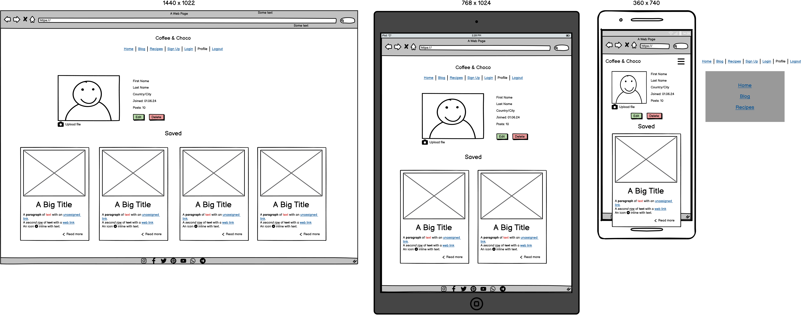

# Coffee & Chocolate Blog [(*Live site*)](https://coffee-choco-blog-7ff7b0b383df.herokuapp.com/)

## Introduction 

Coffee & Chocolate blog is a blog style website for those who love coffee and chocolate. Here users can find articles and recipes as well as post their own. A comments section facilitates communication between users. Only registered users can create new posts, comment and give likes, save favourite recipes or articles to read later. 

## Table of contents

- [Live site](#coffee--chocolate-blog-live-site)
  - [Introduction](#introduction)
  - [Table of contents](#table-of-contents)
  - [UX](#ux)
    - [Target Audience](#target-audience)
    - [User Goals](#user-goals)
    - [Agile Development Tool](#agile-development-tool)
    - [User Stories](#user-stories)
  - [UX design](#ux-design)
    - [Wireframe](#wireframe)
    - [Structure \& Logical Flow](#structure--logical-flow)
    - [Colour Scheme](#colour-scheme)
    - [Fonts](#fonts)
  - [Features](#features)
    - [Existing Features](#existing-features)
    - [Future Features](#future-features)
  - [Technologies Used](#technologies-used)
    - [Coding languages used](#coding-languages-used)
    - [Frameworks and Libraries used](#frameworks-and-libraries-used)
  - [Testing](#testing)
  - [Deployment and local development](#deployment-and-local-development)
    - [Deployment](#deployment)
  - [Credits](#credits)
  - [Acknowledgements](#acknowledgements)

## UX

### Target Audience

* People interested in reading about coffee and chocolate
* People interested in posting recipes or articles about coffee and chocolate
* People interested in finding a community to chat about a given topic (comments section)

### User Goals

**First Time User would like to**

* Find out the purpose of the site and how to use it
* Be able to easily navigate throughout the site
* See a list of posts to see if the site is something they would be interested in
* See the top posts
* Filter post by category
* Be able to register for a user account

**Registered User would like to**

* Sign into their user account
* View posts and leave comments and likes
* Create their own post
* Edit and delete their own posts only
* Logout of their account to keep their account secure

**Site Owner would like to**

* Restrict access to non-registered users
* Control users posts and comments for inappropriate use of the site. All posts and comments must be approved by Admin before they are live on the site

### Agile Development Tool

### User Stories

## UX design

### Wireframe

Home

Blog

Post view

Recipes

Recipe view

Sign Up

Login

Profile

Logout

### Structure & Logical Flow

The database model diagram was designed using Lucidchart

### Colour Scheme

### Fonts

## Features

### Existing Features

### Future Features

## Technologies Used

### Coding languages used

* HTML
* CSS
* Python
* JavaScript

### Frameworks and Libraries used

**Django**
* Framework used to build this project. Provides a built in admin panel and includes many helper template tags that make writing code quick and efficient.

**Django-Allauth**
* Used for User authenticaion (register, login and logout).

**Django Crispy Forms**
* Used to control rendering of Django forms.

**PostgreSQL**
* The database used by the deployed project on Heroku.
  
**psycopg2**
* PostgreSQL database adapter for the Python programming language.

**Gunicorn**
* Python HTTP server for WSGI applications.

**Django RichTextField**
* A Django model field and widget that renders a customizable rich text/WYSIWYG widget.

**Django Resized**
* Resizes image origin to specified size.

**Cloudinary**
* The cloud platform used to store static media files.

**Balsamic**
* Used for the wireframes

**Git**
* Used for version control.

**GitHub**
* Used to store the project's code after being pushed from Git.

**GitPod**
* Used as a platform to develop code in a ready-to-code developer environment.

**Heroku**
* The cloud platform used to deploy the project in the live environment.

**Bootstrap**
* The front end development framework used for styling along with custom CSS.
  
**Lucidchart**
* Used for the entity relationship diagram

## Testing

Detailed testing of the site can be found at [TESTING.md](TESTING.md)

Testing includes the following:

* Validator testing
* Responsivness & Browser Compability Testing
* Manual testing
* Browser testing
* Device testing
* Bugs

## Deployment and local development

### Deployment

## Credits

### Colour Theme

- [Dark Chocolate colour theme by kumakay](https://color.adobe.com/Dark-Chocolate-color-theme-302341/)
- [Brown coffee chocolate beige theme by Elisa Cazzulo](https://color.adobe.com/de09e28a57de007f885d0c16d3e3-color-theme-12966174/)

### Project

- [Blossom-Therapy-Insights blog](https://github.com/Indre-V/blossom-therapy)

### Articles/recipes

- [Chocolate Orange and Lemon Mousse Dessert Cups](https://lilyobriens.ie/blog/post/chocolate-orange-and-lemon-mousse-dessert-cups)
- [Frozen Hot Chocolate](https://www.tasteofhome.com/recipes/frozen-hot-chocolate/)

### Media

- [Coffee and Chocolate photo](https://www.pexels.com/photo/white-printer-paper-on-brown-textile-10254303/)

## Acknowledgements

  - [Cohort Facilitator - Marko Tot](https://github.com/tmarkec) for support in the classroom and guidance through the course.
  - [Mentor - Dick Vlaanderen](https://github.com/dickvla) for support throughout the project, ideas and advice.