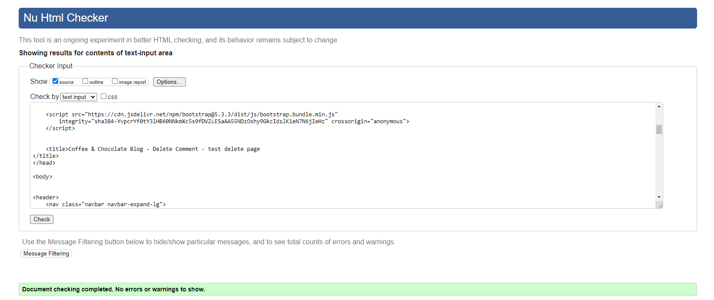
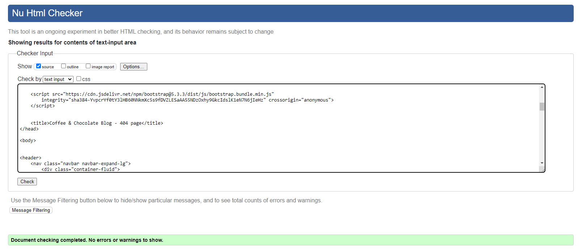
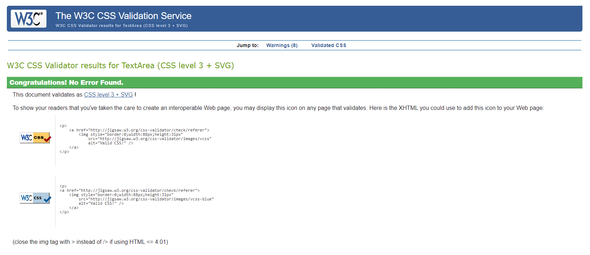

# Testing

# Contents

- [Responsiveness Tests](#responsiveness-tests)
- [Code Validation](#code-validation)
  * [HTML](#html)
  * [CSS](#css)
  * [JavaScript](#javascript)
  * [Python](#python)
  * [Python (Unit Testing)](#python--unit-testing-)
- [Manual Testing](#manual-testing)
- [Role-based Restrictions](#role-based-restrictions)
- [Bugs](#bugs)
- [Browser Compatibility](#browser-compatibility)
- [User Story Testing](#user-story-testing)
- [Lighthouse Testing](#lighthouse-testing)
- [Accessibility Testing](#accessibility-testing)

## Responsiveness Tests

## Code Validation

### HTML

The HTML files were validated using the recommended [HTML W3C Validator](https://validator.w3.org/#validate_by_input).

The process of HTML file validation by direct input:

1. Access the Validator: Visit the W3C Markup Validation Service.
2. Choose Direct Input: Select the "Validate by Direct Input" tab.
3. Paste Your HTML Code: Copy HTML code of the page from deployed website and paste it into the text box.
4. Validate: Click the "Check" button to validate HTML.

Notes:
- The source code for validation has been copied from the deployed version of the website, using "View source code" option.
- Every page extends from base.html and includes header.html and footer.html
- The 403.html page has not been checked, since the user is right away redirected to the Login page.

HTML Validation Results

| **File name** | **Pass** | **Notes** | **Result** |
| --- | --- | --- | --- |
| **Blog App** |  |  |  |
| add_post.html | ✅ | No errors or warnings to show |  |
| comment_confirm_delete.html | ✅ | No errors or warnings to show |  |
| edit_post.html | ✅ | No errors or warnings to show |  |
| post_confirm_delete.html | ✅ | No errors or warnings to show |  |
| post_detail.html ("Types of Coffee Drinks") | ✅ | No errors or warnings to show |  |
| post_detail.html ("Creamy Caramel Chocolate Mini Cakes") | ✅ | No errors or warnings to show. Except "Info: Trailing slash on void elements has no effect and interacts badly with unquoted attribute values". The widget renders post content using \  |  |
| posts.html | ✅ | No errors or warnings to show |  |
| posts.html | ✅ | No errors or warnings to show |  |
| **Home App** |  |  |  |
| index.html | ✅ | No errors or warnings to show |  |
| **Profiles App** |  |  |  |
| profile.html | ✅ | No errors or warnings to show |  |
| **AllAuth templates** |  |  |  |
| login.html | ✅ | No errors or warnings to show |  |
| logout.html | ✅ | No errors or warnings to show |  |
| signup.html | ✅ | No errors or warnings to show |  |
| **Error templates** |  |  |  |
| 404.html | ✅ | No errors or warnings to show |  |
| 500.html | ✅ | No errors or warnings to show |  |

### CSS

The [W3C Jigsaw](https://jigsaw.w3.org/css-validator/#validate_by_input) tool, provided by the W3C, enables to validate and verify the correctness of CSS code. It ensures that your web pages adhere to W3C standards, promoting interoperability and accessibility.

| **File name** | **Pass** | **Notes** | **Result** |
| --- | --- | --- | --- |
| base.css | ✅ | No errors. Two warnings. First, due to imported Google Fonts: "Imported style sheets are not checked in direct input and file upload modes". Second, due to variables used to assign some fonts and colours: "Due to their dynamic nature, CSS variables are currently not statically checked" |  |

### JavaScript

No major errors were found when validating JavaScript through [Jshint](https://jshint.com/).

Jshint noted that bootstrap and tooltipList variables are undefined. This can be ignored because they rely on bootstrap javascript.

### Python

The python files have all been passed through [CI Python Linter](https://pep8ci.herokuapp.com/)

<b>Test Results</b>

| **File name** | **Pass** | **Result** |
| --- | --- | --- |
|  |  | **Blog App** |
| admin.py | ✅ |  |
| apps.py | ✅ |  |
| forms.py | ✅ |  |
| models.py | ✅ |  |
| urls.py | ✅ |  |
| views.py | ✅ |  |
|  |  | **Coffee_Choco App** |
| asgi.py | ✅ |  |
| settings.py | ✅ |  |
| urls.py | ✅ |  |
| wsgi.py | ✅ |  |
|  |  | **Home App** |
| apps.py | ✅ |  |
| urls.py | ✅ |  |
| views.py | ✅ |  |
|  |  | **Profiles App** |
| admin.py | ✅ |  |
| apps.py | ✅ |  |
| forms.py | ✅ |  |
| models.py | ✅ |  |
| urls.py | ✅ |  |
| views.py | ✅ |  |

 

## Manual Testing

Extensive manual testing was performed on the application. Each feature was verified against success criteria. Where applicable, negative testing was conducted by providing invalid or unexpected inputs to assess the application's robustness in handling errors and exceptions.

<b>Manual Testing Results</b>

| **Test Case** | **Element** | **Action** | **Success Criteria** | **Result** |
| --- | --- | --- | --- | --- |
| **Blog App** |  |  |  |  |
|  |  |  |  | ✅ |

 